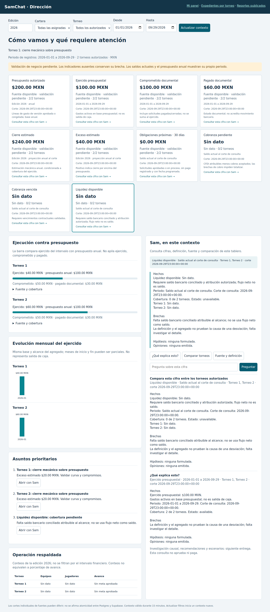
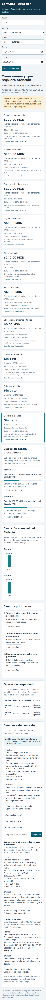

# Evidencia técnica local · #431

Fecha 2026-09-30; Python 3.12.14; base `78d77cb72279291bc896967cc113d4c7fd38f852`.
Sin despliegue, conexión productiva, cuentas de dueños o UAT de negocio.
Diseño, matriz de indicadores, decisiones y salida a UAT:
[direction-home-431.md](../../design/direction-home-431.md).

- Unitarias / HTTP / regresión / canons: **301 passed**, 6 warnings de deprecación
  existentes. [Log](unit-http.log). Cobertura **99.02%** de los tres módulos nuevos
  home/conversation/home_ui; no es cobertura de todo el repositorio.
- Chromium 134: **1 passed**. La prueba de `tests/browser/test_direction_home_browser.py`
  recorre selección → explicación → evidencia → comparación → historial → móvil sin
  overflow → cambio de cartera (resetea torneo) → nueva edición/periodo → nueva consulta
  sin reutilizar conversation_id. Fuentes y respuestas HTTP interceptadas/sintéticas;
  la persistencia/autorización real del endpoint se prueba aparte mediante TestClient.
- Guard runtime/empaquetado/docs: **OK**. [Log](packaging.log).
- `git diff --check`, flake8 de módulos/pruebas nuevos y compilación Python: **OK**.
- SHA-256 de los tres canons coincide con el registro; governance tests incluidos.

## Alcance de las pruebas

Las pruebas cubren sumas decimales, cero real frente a ausencia, cobertura parcial,
intervalos por edición, rechazo de versiones no aprobadas/artifacts, CFDI compartidos,
moneda e importes ausentes, serie mensual conciliante/no conciliante, urgencia de pagos,
UUID/cartera ajenos, candidatos AR fuera de scope, matches de ítems autorizados,
fuente financiera de documentos sin gastos/pólizas globales, TTL/firma/actor/CSRF,
revocación de torneo o permiso, continuidad de conversación en tablas canónicas,
pregunta factual de pagado frente a instrucción de pago, escape y navegación.

## Pendientes para aceptar #431

1. Verificar commit/runtime y asset efectivamente servidos en el ambiente de revisión.
2. Contrastar consultas y rendimiento con datos reales; conciliar versión, distribución
   de CFDI, moneda, estados documentales, pagos y matching de cobranza.
3. Validar saldos bancarios, términos de vencimiento y metas operativas para habilitar
   indicadores que hoy conservan `Sin dato` / `Sin meta aprobada`.
4. Recorrido sin guía del dueño en un minuto con sus cuentas y alcance efectivo.
5. Acta de aceptación de negocio con cortes/importes/fuentes/responsables y discrepancias.
6. Recorrido y conciliación con escenarios/exportación: dependencias #432/#433.

La prueba de navegador acredita comportamiento con fixtures, no disponibilidad de
fuentes reales ni autenticación de producción. #431 y #430 permanecen abiertas.
